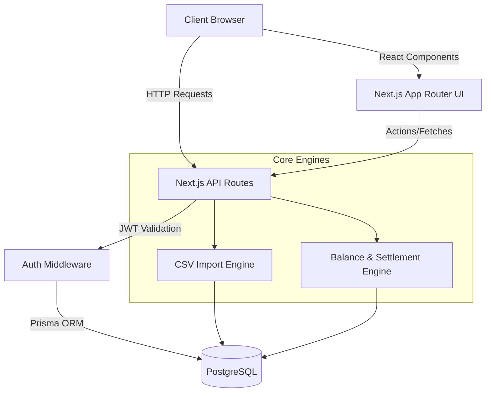

# Shared Expenses App

A production-ready shared expenses application designed to simplify group expense tracking, bill splitting, and debt settlement. Built with Next.js 15, TypeScript, Tailwind CSS, shadcn/ui, Prisma, and PostgreSQL.

## Features

- **Group Management**: Create groups with active membership timelines (join and leave dates).
- **Expense Tracking**: Add, edit, and delete expenses with various split types (Equal, Percentage, Exact, Unequal).
- **Multi-currency Support**: Store both original and base currency (INR, USD) amounts with exchange rate tracking.
- **Advanced CSV Import Engine**: Upload, parse, and validate CSV files. Includes a robust anomaly detection system to review and fix issues before finalizing imports.
- **Mathematically Correct Balance Engine**: Calculates net balances, pairwise debts, and provides simplified settlements using a debt simplification algorithm.
- **Authentication**: JWT-based email/password authentication.
- **Audit Trails**: Full tracking for data modifications and imports.

## Architecture Diagram

## Tech Stack

- **Frontend**: Next.js 15, React 19, TypeScript, Tailwind CSS, shadcn/ui
- **Backend**: Next.js Route Handlers (`/api`), Node.js
- **Database**: PostgreSQL
- **ORM**: Prisma
- **Authentication**: Custom JWT (http-only cookies)
- **Testing**: Vitest / Jest

## Getting Started

### Prerequisites
- Node.js >= 18
- PostgreSQL

### Installation

1. Clone the repository
2. Install dependencies: `npm install`
3. Copy `.env.example` to `.env` and set your `DATABASE_URL` and `JWT_SECRET`.
4. Run Prisma migrations: `npx prisma db push`
5. Generate Prisma Client: `npx prisma generate`
6. Start the development server: `npm run dev`

### Project Structure
- `src/app/`: Next.js App Router pages and API routes
- `src/components/`: Reusable React components (shadcn/ui + custom)
- `src/lib/`: Core utilities, Balance Engine, Import Engine, Prisma setup
- `prisma/`: Prisma schema and migrations
